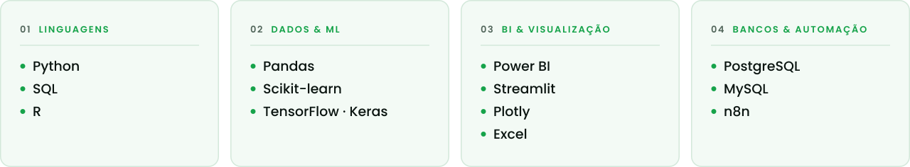

  <picture>
    <source media="(prefers-color-scheme: dark)" srcset="assets/banner-dark.svg">
    
  </picture>

  <picture>
    <source media="(prefers-color-scheme: dark)" srcset="assets/digitacao-dark.svg">
    
  </picture>

  Transformando dados brutos em insights estratégicos que geram valor real para o negócio.

  🔍 <strong>Aberto a oportunidades</strong> em Dados e Ciência da Computação · <strong>Remoto</strong> · CLT

  
  
  

  

  <strong>Dashboard de Logística e Entregas</strong> — Python · Streamlit · Plotly ·
  <a href="https://github.com/ribeirolucas962/projeto_entrega">ver o projeto</a>

---

## 🧭 Sobre mim

Profissional em transição da **Eletrotécnica** para a **Ciência de Dados**. Doze anos resolvendo problemas técnicos em campo — telecomunicações, redes e sistemas elétricos — me deram o que hoje considero minha maior vantagem como analista: diagnóstico estruturado e leitura de causa raiz. É a mesma disciplina, aplicada a dados.

Atuo desde a captura e o tratamento dos dados até a entrega de dashboards e relatórios acionáveis, com foco em análise estatística, modelagem preditiva e visualização.

📍 Barra Velha / SC

---

## 🚀 Projetos em destaque

| Projeto | O que faz | Stack |
|---|---|---|
| **[Dashboard de Logística e Entregas](https://github.com/ribeirolucas962/projeto_entrega)** | Painel analítico para bases de logística: tratamento da planilha em memória, KPIs de SLA, atraso, devolução e custo, com filtros dinâmicos e insights automáticos. | Python · Streamlit · Plotly |
| **[Detecção de Fraude em Transações](https://github.com/ribeirolucas962/Modelo_de_Fraude)** | Classificação de transações financeiras: EDA, tratamento do desbalanceamento com SMOTE e comparação entre Random Forest, SVM e KNN. | Python · Scikit-learn · SMOTE |
| **[Sistema de Gestão para Oficina Mecânica](https://github.com/ribeirolucas962/sistema-oficina)** | Sistema desktop completo: clientes, veículos, ordens de serviço, estoque, financeiro, caixa e dashboard com relatórios em PDF. | Python · GUI |
| **[Análise do Sistema Fotovoltaico no Brasil](https://github.com/ribeirolucas962/Projeto-energia-solar)** | Tendências de crescimento da energia solar de 2009 a 2025 sobre dados da ANEEL, com leitura de sazonalidade e variação anual. | Python · Pandas · Estatística |
| **[Machine Learning na prática](https://github.com/ribeirolucas962/Projeto_aprendizado_de-maquina_Scikit_learn_Keras_TensorFlow)** | Implementação dos estudos do "Mão à Obra" (Géron): redes neurais e modelos de deep learning para classificação e previsão. | Scikit-learn · Keras · TensorFlow |

  

  <strong>Sistema de Gestão para Oficina Mecânica</strong> — dashboard financeiro, com dados de demonstração ·
  <a href="https://github.com/ribeirolucas962/sistema-oficina">ver o projeto</a>

🔎 **[Ver o portfólio completo →](https://ribeirolucas962.github.io/Portifolio_atualizado-/)** — com certificados, trajetória e currículo.

---

## 🛠️ Tecnologias & Ferramentas

<picture>
  <source media="(prefers-color-scheme: dark)" srcset="assets/tecnologias-dark.svg">
  
</picture>

---

## 🧠 Áreas de interesse

- Inteligência Artificial, Machine Learning e Deep Learning
- Automação de processos e análise preditiva
- Web Scraping, Visualização de Dados e Storytelling
- Business Intelligence com Power BI e Excel
- Análise de Dados com Python, SQL e R

---

## 🎓 Formação

| Período | Formação | Instituição |
|---|---|---|
| 2026 – 2030 *(cursando)* | Bacharelado em Ciências da Computação | Anhanguera |
| Concluído em 2025 | Graduação em Ciência de Dados | Anhanguera |
| Concluído em 2025 | Formação em Estatística e Ciência de Dados | Comunidade Estatidados |
| Concluído em 2024 | Formação em Dados | Escola DNC |

---

## 📈 Atividade

<picture>
  <source media="(prefers-color-scheme: dark)" srcset="https://raw.githubusercontent.com/ribeirolucas962/ribeirolucas962/output/cobrinha-dark.svg">
  
</picture>

---

  <a href="https://www.linkedin.com/in/lucas-ribeiron/">LinkedIn</a> ·
  <a href="mailto:ribeirolucas962@gmail.com">ribeirolucas962@gmail.com</a> ·
  <a href="https://wa.me/5547992655187">WhatsApp</a> ·
  <a href="https://ribeirolucas962.github.io/Portifolio_atualizado-/">Portfólio</a>

